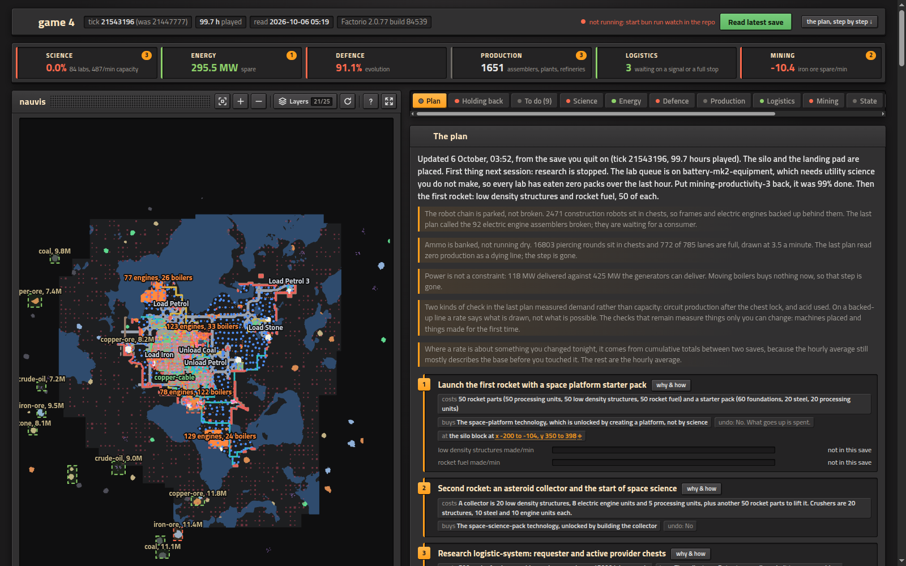

# factorio-advisor

A read-only advisory toolkit for a vanilla Factorio 2.0 Space Age playthrough. It answers ratio, technology and throughput questions from the game's own declared numbers, audits blueprint strings, and reads the state of your base out of a copy of your save. It never touches your saves, your mods or your config.

Sibling of `wesnoth-advisor`, with one structural difference. A Wesnoth save is plain text, so that tool reads the live board directly. A Factorio save is a version-locked binary blob, so this one works from two sources instead: what the game declares before a map exists (every recipe, machine, module, technology, belt and quality tier), and what the engine itself reports when asked to tick a copy of your save. Between them they cover the questions Factorio actually provokes.

## What it tells you about your own base

```bash
bun run report --save="game 4"   # read the save, write a report, render the dashboard
bun run advise --spm=45          # what limits you now, and what the next step costs
bun run bus --save="game 4"      # your buses: lanes, what they carry, how saturated
bun run watch                    # leave it running: every save becomes a report
```



`report` writes `reports/index.html`. Across the top, one tile per section (science, energy, defence, production, logistics, mining) with its headline figure and how many pieces of advice it holds. On the left, one zoomable, layered map of your base. On the right, tabs: the written plan, what is holding the base back, the to-do list the advice adds up to, each section in full, and the raw state. Each section carries its figures, its tables, the advice that belongs to it, and the map layer its header turns on, so a step like "the steel block, 30 furnaces at x -274.5 to -223.5, y -102.5 to -96.5" is one click from the place it names. Advice that names a place names an area corner to corner, never a bare point.

The map is drawn tile by tile in your save's own coordinates. Every entity is at the footprint its prototype declares and the position the engine reported, drawn with the game's own art and answering a click with what it is. Water and ore are at tile resolution; the charted extent and the enemy nests inside it are there for context; train stops carry the names you gave them. Close in, it shows what the game's alt mode shows: each machine's recipe and modules, what each chest or tank holds, the item riding each belt lane and the fluid in each pipe. The map keeps its controls on itself the way the game's map view does: fit, zoom, a layer panel, refresh, a `?` for the keys, and a full-window mode with an overview. Nothing on it is drawn that was not measured, and the footer says which is which. The art and icons are the game's own, read out of your installation at render time and never copied into this repository.

When a plan exists for the save at `data/plans/<save>.json`, the page shows it step by step: what each step costs, what it buys, whether it can be undone, where it is, and progress bars read from the save rather than ticked by hand. Every coordinate in the plan is a link that outlines its place on the map. An autosave picks up the plan of the game it belongs to by matching the map seed. The page also keeps a ledger of milestones per map (hours played, technologies, rockets launched, lifetime production) and marks only what a later read newly finds, never what was already true the first time.

`bun run report --page` redraws the page from the last read without launching anything, which is the loop for working on the dashboard rather than on the base. With `bun run watch` running, the open page reloads itself after each save and its "Read latest save" button triggers a read on demand.

Every recommendation carries the measurement that produced it. That is the point of the project: not "build more smelters", but "iron ore is running 263/min behind what your furnaces eat, and the patch under your 82 drills has 4.8M left against an untouched 11.4M at -128, 1376".

## Quick start

```bash
bun install
bun run sync                              # once, and again after a game update
bun run ratio electronic-circuit --rate=45/min
```

Requires Bun and a Steam install of Factorio 2.0 with Space Age. The install and your user directory are found automatically; `FACTORIO_CORE` and `FACTORIO_USERDATA` override them (see `src/paths.ts`).

`sync` launches Factorio headless for about three seconds with its write-data redirected into this project, so the dump lands in `data/` and `~/.factorio` is never written to.

Every rate flag takes a unit: `/s`, `/min` (or `/m`) and `/h`. **A bare number is per second**, so `--rate=45` asks for 2700 a minute. `advise --spm` is the exception and is always per minute.

Two kinds of run launch the engine: `sync`, and every read of a save (`state`, `report`, `watch`, and `bus` without `--reuse`), which copies your save and reads the copy. Everything else reads what those wrote and launches nothing. None of them ever writes to a game directory, and the probe that proves it is under [What it will not do](#what-it-will-not-do).

To ask about your actual base, save in game (or let an autosave fire) and then:

```bash
bun run state                             # reads your newest save, autosaves included
bun run next                              # what you can research now
bun run power                             # generation against draw
```

## Commands

Prototype questions, answered from the snapshot alone:

```bash
bun run sync                                  # refresh the prototype snapshot (launches Factorio headless)
bun run search asteroid                       # find prototypes by name across every class (--limit=40)
bun run recipe rocket-fuel                    # ingredients, results, every machine that can run it, unlocking tech
bun run ratio processing-unit --rate=300/min  # full production chain, machine counts, power, pollution, raw inputs
bun run tech kovarex --path                   # cost, prerequisites, the whole research path with totals
bun run belt iron-plate --rate=45/min         # which belt tier carries it, at what saturation, inserter ceilings
bun run bp --file=blueprint.txt               # decode and audit a blueprint string or book
bun run bp --file=bp.txt --rate=45/min        # judge that print against a target rate
bun run bp --file=bp.txt --draw               # draw that print with the game's own art, as a page under .local/
bun run gen electronic-circuit --rate=45/min  # one recipe step, laid out as a placeable row
```

Questions about your base, answered from a read of your save:

```bash
bun run state --save "game 4"                 # live state, read from a copy of your save
bun run next                                  # what you can research right now
bun run next --for=carbon-fiber               # the path from here to what unlocks an item or technology
bun run power                                 # generation against draw, from your census
bun run advise --spm=45                       # where the base stands and what the next step costs
bun run bottleneck                            # machine classes by how busy they are, lines by what is spare
bun run bus --save="game 4" --map             # buses, lanes, saturation, and the corridors on the map
bun run watch                                 # watch your saves; every save becomes a report
bun run report                                # write one report for the newest save now
bun run report --page                         # redraw the dashboard from the last read, no engine run
bun run typecheck                             # tsc --noEmit
```

Every command that answers about a save takes `--save=<name>`, the name as it appears in your save list. Without it, `state`, `bus` and `report` read the newest save on disk, and `next`, `power`, `advise` and `bottleneck` answer from the newest read already on file. `state`, `next`, `power`, `advise` and `bottleneck` also take `--force=<name>` (default `player`). `bun src/cli.ts help` prints the advisor's own usage.

### ratio

```bash
bun run ratio plastic-bar --rate=90/m
bun run ratio plastic-bar --rate=30/min --recipe=petroleum-gas=advanced-oil-processing
bun run ratio electronic-circuit --rate=45/min --machine=assembling-machine-3 --modules=productivity-module-3x4 --beacons=8
```

| Flag | Meaning |
|---|---|
| `--rate=90/min` / `1.5/s` / `5400/h` | target output rate; a bare number is per second, and the default is 1/s |
| `--machine=<name>` | prefer this machine wherever it can run the category |
| `--modules=<name>x<n>,...` | modules in every machine; what does not fit is reported |
| `--beacons=<n>` `--beacon-modules=<spec>` | beacons reaching each machine, with the Space Age falloff profile applied |
| `--beacon=<name>` | which beacon prototype; the first the snapshot declares otherwise |
| `--recipe=<product>=<recipe>,...` | override a recipe choice; several pairs separated by commas |
| `--raw=iron-plate,copper-plate` | treat these as bought in and stop expanding there |

The solver states its own choices. When a product has several recipes it names the ones it declined and prints the flag that would switch them, so a default you disagree with is one flag away rather than buried.

### state

```bash
bun run state --save "game 4"        # the save name as it appears in your save list
bun run state --save "game 4" --top=20 --force=player
```

Reports what your base has actually done: how many technologies are researched, what is being researched now and what is queued behind it, the items and fluids you make and use with their one-hour average rates and their lifetime totals, every machine you have placed counted by prototype, power delivered, evolution and pollution per surface, and what is sitting in your logistic network. `--top=<n>` sets how many production rows to print (default 10).

The same read also collects what the dashboard draws: every placed entity's position, water and ore as tile runs, charted chunks and enemy nests, trains with their schedules and state, train stops by name, logistic networks with their robot fleets, the contents of chests and tanks, each machine's recipe and modules, and what each pipe carries.

With no `--save` it reads the newest save in your save directory, autosaves included, so the loop is: save in game, then ask.

It works by copying your save into `.factorio-runtime/saves/`, appending a collector to the copy's own `control.lua`, and running the engine against the copy in benchmark mode. Your save is never opened in place and never written back. No mod is installed, so a save made with mods still loads.

Rates are the game's own one-hour average expressed per minute, recorded in both directions, made and used, because the gap between them is the diagnosis. Totals are cumulative since the map was created. The parsed result is written to `data/state/<save>.json` so other commands can build on it; its full schema, and the two engine conventions that are easy to get backwards, are in [`STATE.md`](STATE.md).

### next

```bash
bun run next                         # everything researchable right now, cheapest first
bun run next --for=carbon-fiber      # the path from where you are to that item
bun run next --for=kovarex-enrichment-process   # a technology name works too
bun run next --save "game 4" --top=40 --force=player
```

Reads the state file `bun run state` wrote and intersects it with the technology tree. A technology is listed exactly when it is not researched and every one of its prerequisites is. Nothing is ranked by taste: the table is sorted by lab-seconds, and `opens` says how many further technologies each one unblocks, so a cheap tech that opens six others is visible as such.

Lab-seconds are given twice: at speed 1, and at your actual lab speed read from the save, which is the number that tells you how long a technology will really take. Research progress on the current technology is printed too.

`--for` takes an item or a technology. Given an item, it finds which technology gates it, says which recipe that is via, lists the alternatives when several would do, and then prints only the part of the path you have not already researched, with the science totals for what is left.

Trigger technologies are shown as the action they want rather than as zero cost, because in Space Age a good deal of progress is unlocked by doing rather than by researching. Lab productivity is not applied to the lab-seconds; the column at your speed divides by the lab speed bonus the save reports and nothing else. `--top=<n>` caps the table.

If a save carries technologies this snapshot has never heard of, from another version or a modded run, they are listed rather than dropped. A silently shorter answer would look exactly like a correct one.

### power

```bash
bun run power                        # uses your newest save's state
bun run power --save="game 4"        # or a named one
```

Prices your base two ways. **Delivered** is what your grid actually did over the last hour, copied from the game's own electric network statistics across every network you have, so it is measurement rather than arithmetic. **Draw** is the ceiling if every machine ran at once, priced from the machine census. The gap between them is duty cycle.

Then the rest, from the census: Generation by source with the prototype fields each figure came from, the steam chain and whether your boilers can actually feed your engines, accumulator capacity, and the draw of every machine type if all of them ran at once.

Every watt is derived, and the `derived from` column tells you how, so you can redo any of it by hand from `data/data-raw.json`. A steam engine, for instance, is `fluid_usage_per_tick 0.5 x 60 ticks x (maximum_temperature 165 minus steam's default_temperature 15) x steam heat_capacity 0.2kJ x effectivity 1`, which is 900 kW.

Solar reports both peak and the average over a day-night cycle, and the average is not a remembered constant. The cycle length is a prototype field (`planet.surface_properties.day-night-cycle`, 25200 ticks on Nauvis) and the curve itself is read off the surface when `state` runs. Lit from dawn round to dusk, dark from evening to morning, linear between, which on Nauvis gives 0.7. If you are reading an older state file that predates the curve being collected, it says so and reports peak only rather than inventing a factor.

The census counts every entity class the game declares with an energy source of any kind, and that list is read off the running game rather than typed here. The first version listed twelve classes by hand and silently missed inserters, roboports, radars, lamps, pumps, turrets and accumulators, which understated the draw ceiling by 73 MW on a real base. A hand-written list cannot fail safely: nothing warns you about the class you forgot.

Drain is copied from the engine, not inferred. A radar declaring no drain resolves to zero; an assembling machine declaring none resolves to a thirtieth of its usage. No single rule produces both, so no rule is applied.

Some machines draw per event rather than per second. An inserter spends `energy_per_movement` on each swing, a radar `energy_per_sector` on each scan. Their idle drain is in the total, because it is paid every tick, but the per-event cost is listed separately and left out, since converting it to watts needs a swings-per-second that no prototype declares. That is the same wall the inserter throughput figure hits, and it is not worth guessing past.

Two honest limits, both printed. Draw is a ceiling, since no base runs every machine at once; what the grid really did is the Delivered section above. And where the boilers cannot feed the engines built, the steam-limited figure is computed and the balance drawn against that, because the nameplate number would otherwise be a fiction. A state file read before power delivered was collected says so, and only then is generation nameplate alone.

### advise

```bash
bun run advise                 # target defaults to twice the best current pack line
bun run advise --spm=45        # where the base stands against 45 packs a minute, PER MINUTE
bun run advise --top=18        # how many requirement gaps to list
```

The synthesis. It reads the science pack lines and the pack that sets the pace, lab utilisation against the current research's own `unit.time` and your lab speed, grid headroom against the steam-limited capacity `power` derives, and, for a target rate, what the extra chain needs per item against what the base has spare. Spare is made minus used, never total production, because a requirement compared against total production calls a saturated line healthy. Every recommendation carries the measurement that produced it. Advice that names a place names an area, corner to corner with its size, and an outpost is never recommended for a resource whose belts and chests are already full.

### bottleneck

```bash
bun run bottleneck                     # from the newest read
bun run bottleneck --save="game 4" --top=20
```

Answers "what is holding the factory back" with readings that are never blended. **Machine classes** by how much of their time the output accounts for: how many times each recipe ran, charged back to the classes that could have run it, split by count times crafting speed where several share a recipe. **Items and fluids** by what is left over against their own demand, biggest hole first. And a **sinks** column saying how full the belts and chests carrying each product are (`backed-up`, `flowing`, `starved`, or `no sink read`), which is what says whether a spare figure is capacity or demand: a backed-up line makes exactly what its consumers take, and more of it changes no number.

Which recipes are running is solved from the base's own rates rather than chosen by the default rule, so oil processing, for instance, lands on the mix your refineries actually run. Module loadouts are a standing gap, since a save read reports none, and the output says so rather than estimating.

### bus

```bash
bun run bus                          # the newest save, read fresh
bun run bus --save="game 4" --map    # and write the corridors onto the base map
bun run bus --save="game 4" --reuse  # answer from the last survey on disk, no engine run
```

The belt survey: belt runs grouped into buses, each lane with what it carries and how saturated it is against the item's own rate. The survey is collected by the same save copy a state read uses, so the default launches the engine once and answers both.

### watch and report

```bash
bun run watch                     # leave it running; save in game and a report appears
bun run report                    # one report for the newest save, now
bun run report --save="game 4"    # or a named one
bun run watch --threshold=120     # only mention rate changes of 120/min or more
```

`watch` polls your save directory and, when a save stops changing, reads it the same way `state` does: your save is copied into this project and the copy is read. It then writes `reports/<save>-<tick>.md` and regenerates `reports/index.html`. While it runs it also serves the page's live loop on `127.0.0.1:8737` (`FACTORIO_ADVISOR_PORT` overrides): an open page reloads itself after a new read, and its "Read latest save" button asks for one.

`report` is the same read done once, now. `report --page` skips the read and redraws `reports/index.html` from the state file already on disk.

A report is a diff, not a description. The first one for a save describes, because there is nothing to compare against; every later one names only what moved and says so when nothing did. You already know how many solar panels you have; what is worth telling you is that eleven appeared and that coal fell 61/min. The threshold for a production change is printed in the report rather than hidden, because a number that decides what you get told about should be arguable.

Reports are named by game tick, not wall clock, so re-reading an unchanged save produces nothing rather than a second identical report.

Every figure on the page carries `data-source` and `data-field` naming the state file and the exact path inside it that produced the number, so any figure can be checked against the JSON without reading the renderer.

`reports/` is gitignored: it is derived from saves and rebuilt by running the command again.

Run the loop from the main checkout only. Reading a save writes `data/state/<save>.json`, and a watcher in one git worktree plus a command in another would share that file with nothing coordinating them.

### gen

```bash
bun run gen electronic-circuit --rate=45/min
bun run gen iron-plate --rate=100/min --belt=fast-transport-belt
bun run gen electronic-circuit --rate=45/min --machines=8                 # pin the count instead
bun run gen electronic-circuit --rate=45/min --machine=assembling-machine-2 --draw
```

Lays ONE recipe step out as a row and prints a blueprint string you can paste into the game: machines side by side, an input belt above, an output belt below, an inserter per machine per side. The string is printed last and alone, so it is easy to copy. `--machine=<name>` picks the machine, `--belt=<name>` the belt tier, and `--draw` draws the row it built (see `bp` below). A recipe with a fluid ingredient or product is refused, because a belt row cannot carry it.

Machine counts round up, so the row meets the target and the overcapacity is printed and written into the blueprint label, where it survives into your game. `--machines=<n>` pins a count instead and tells you the rate that gives, shortfall included. The belt tier is picked for the rounded-up rate, and a row that outruns its belt says so rather than quietly running at 140%.

Every coordinate comes from the prototypes. Footprints are read from `selection_box`, which is the real tile size, rather than `collision_box`, which is inset so you can walk past things. A prototype with no selection box gets nothing placed and the gap is printed, because a guessed size puts entities in the wrong tiles.

Both sides are sized. The output belt tier is picked for the rounded-up rate, and the input demand is computed from the recipe and reported per ingredient, with the number of input lanes the row would need. The row lays one lane each way and tells you when that is not enough, rather than drawing a picture that cannot run. Inserters are picked by rotation ceiling, and when no tier in the game keeps up with the row's throughput, it says that too.

One step only. A whole chain or a main bus is out of scope and the output says so; `bun run ratio` is what sizes a chain. Check a generated row the same way you would check anyone else's: `bun run bp --rate=<same>` reads it back and re-derives its rates through a different code path.

### bp

```bash
bun run bp --file=blueprint.txt                      # a string from a file
bun run bp --string='0eNq...'                        # or inline; a positional argument or stdin works too
bun run bp --file=bp.txt --rate=45/min --item=electronic-circuit
bun run bp --file=bp.txt --draw                      # a page under .local/; --svg for the bare SVG, --out=<path> to place it
```

With `--rate=<n[/s|/min|/h]>` the audit stops describing the print and starts judging it: what fraction of the target it reaches, how many of the print the target would take, what that scale means per machine type, whether the belt tier it places carries the target, and how many inserters per machine the target needs at the rotation ceiling. `--item=<name>` picks which product to judge; without it the print's largest net export is used and the output says so.

A print scales as a unit, so every step scales with it, including steps that make none of the target item. The output says that too, because the alternative is a column that reads like a per-recipe requirement and is not one. To size a single recipe rather than a whole print, use `bun run ratio`.

`--draw` (or `--render`, which is the same flag) writes a page under `.local/` showing the print as the game draws it: every entity is its own sprite, cut out of your installation at the cell its prototype declares, placed at the position the string states and at the sprite's own size and shift. `--svg` writes the bare SVG instead, and `--out=<path>` puts either wherever you want it. `bun run gen ... --draw` draws the row it just laid out, straight off the object rather than through a decode of its own string.

The art is read from the game and never copied into this repository. Sprites are cut into `.local/sprites/`, which is ignored by git, and embedded in the page so you can move the file around; the repository is public and Wube's art stays out of it. Nothing is written inside the installation, which is the same read-only property every other command holds.

Which picture an entity gets is derived, not listed. Every prototype declares where its sheet is, how big a cell is and how many frames and directions it holds, so the cell is arithmetic; the row length is measured from the sheet's own width rather than taken from a default that differs between an animation and a rotated sprite. Of the 140 prototypes a blueprint can hold, 132 resolve a sprite, and the eight that do not are ore and scrap, which are resources no print contains.

Belts and pipes are shaped the way the engine shapes them, from their neighbours. A belt fed from the side is drawn as the curve, one nothing feeds gets its start cap, one whose output goes nowhere gets its end cap, and only a belt fed from behind is the plain straight. A pipe carries no direction at all, so its picture is chosen from the sides it is open on, and a junction reads as a junction. One thing it does not do, and says so on the page: an inserter is drawn as its base without its hand, because the string says which way it faces and not which of its two ends that names. A prototype with no resolvable sprite keeps a coloured category box, which is the fallback rather than a failure, and the page names it.

Direction is applied where it changes the footprint: 4 is East and 12 is West, both of which swap width against height, measured from underground belt pairs in the shipped test prints rather than recalled. A belt carries the game's own arrow for the way it runs, `indication_arrow` out of `utility-sprites`, the same yellow chevron the engine draws over a belt, turned by the belt's own direction. An inserter carries its rotation and no arrow, because the string does not say which of an inserter's two ends its direction names. The odd sixteenths are diagonal, no declared box describes a rail at 45 degrees, and those are drawn unrotated and counted on the page rather than guessed at.

The category boxes from the first version are still there, as a layer the page can switch on over the art, for reading a layout by category rather than by silhouette.

Every figure on the page is the audit's. The drawing marks, with a dashed outline, the machines that the audit's own shortfalls land on, and it computes no rate of its own.

Without `--rate` the output is exactly what it was before the flag existed.

Feed it a blueprint string from a file, an argument, or stdin. Books are unrolled. The audit resolves every machine's real module loadout, works out which beacons physically reach it from the positions in the print, runs each machine, and nets the flows: what the print needs fed in, what it exports, and what it balances internally.

## What it will not do

**Touch your game.** Not the install, not `~/.factorio`, not your saves, not your mods, not your blueprint library. `sync` and `state` both launch Factorio headless with its write-data redirected into this project, and `state` reads a *copy* of your save rather than the save itself. After a full run, `find ~/.factorio -newermt "<run start>"` and the same over the Steam install both come back empty. That probe is the anti-claim, and it is checked by running it, not by reading the code.

**Read a running game.** `state` reads a save on disk, so it is as fresh as your last save, not as fresh as the session you are playing right now. Nothing here connects to a live game or sends it input.

**Invent a number it cannot read.** Two places where this bites, both reported in the output rather than papered over:

- Inserter throughput. The tool reports the rotation-bound ceiling from `rotation_speed` and says plainly that real throughput depends on belt chasing and the inserter capacity research, which are not prototype facts.
- Quality-scaled module effects. Quality raises a module's effect in game, but the scaling is an engine rule absent from the prototype data. A blueprint using quality modules gets a warning that the figures understate it.

**Guess at your tech level.** `ratio` defaults to the fastest machine that can run each category, which on a Space Age snapshot means foundries and electromagnetic plants. Use `--machine` for the tier you actually have.

## How it is put together

```
src/            the advisor, bottom up. Nothing in it imports bridge/.

paths.ts        find the install and the binary; FACTORIO_CORE / FACTORIO_USERDATA override; the only paths written to
dump.ts         runs Factorio for the prototype dump, with write-data redirected into this project
proto.ts        load and index the snapshot; every other module reads through here
energy.ts       parse "375kW", "1.5MW", "0.2kJ", keeping power and energy distinct
recipes.ts      normalise recipes, index by product, choose a default and justify it; recycling excluded
machines.ts     machines for a category, effective speed under modules and beacons, power, pollution
solve.ts        target rate to machine counts, raw inputs, byproducts, power, pollution
belts.ts        belt throughput (exact) and inserter ceilings (labelled as ceilings)
tech.ts         prerequisite closure, science cost, research paths, trigger technologies
blueprint.ts    decode and encode blueprint strings
audit.ts        entity census, beacon geometry, net flow analysis of a print
target.ts       judges an audited print against a target rate
layout.ts       lays one recipe step out as a row and emits a blueprint string
pipes.ts        fluid ports from each machine's own prototype, and whether a print is plumbed
draw.ts         draws a print to scale with the game's own art
sprites.ts      cuts in-world art out of the installation at the cell each prototype declares
belt-shape.ts   which belt picture a tile takes, from what its neighbours do
pipe-shape.ts   which pipe picture a tile takes, from the sides it is open on
icons.ts        resolves the game's own icons in the installation, by file:// URL, never copied
state.ts        runs Factorio over a copy of a save and reads live state and geometry back
next.ts         intersects the tech tree with what a save says is already researched
power.ts        generation, steam chain and draw, priced from the machine census
advise.ts       the synthesis: what limits the base and what the next step costs, with its numbers
bottlenecks.ts  machine-class utilisation and item tightness, solved from the base's own rates
saturation.ts   how full the belts and containers carrying each product are
bus.ts          belt runs grouped into buses, lanes priced against the item's own rate
map.ts          chunks clustered into power blocks and ore fields, in the save's own tile coordinates
layers.ts       the one map's layers: footprints, art, alt mode, labels that never overprint
sections.ts     the dashboard cut into science, energy, defence, production, logistics, mining
plan.ts         the written plan for a save, every figure in it read from the state file at render time
render.ts       tables for the terminal
cli.ts          the advisor's only entry point and the only place that formats its output

bridge/         the loop around the advisor. It imports src/; src/ never imports it.

cli.ts          the bridge's entry point (bun run watch, bun run report), separate from the advisor's
watch.ts        polls the save directory, drives the loop, serves the page's reload and read button
report.ts       what changed since the last report for this save
page.ts         the dashboard, every figure carrying the field it came from
milestone.ts    the per-map ledger of milestones, keyed by map seed
```

Design rationale and the decisions behind it are in `DESIGN.md`; the architecture at the level of each module's rules is in `CLAUDE.md`. What "done" means, with falsifiers, is in `ISA.md`.

## Where things are written down

- `DESIGN.md`: the decisions and why, as numbered ADRs.
- `STATE.md`: the schema of the state file every command reads, and the two engine conventions that are easy to get backwards.
- `ISA.md`: the state of record. Its claims are the test suite, and its "Not yet specified" section is the real backlog.
- `CLAUDE.md`: the architecture module by module, the constraints that must hold, and how work lands in this repo.
- `.claude/skills/Factorio/`: how to use this toolkit and how to read a base, for an agent or a person.
- [Issues](https://github.com/Soushi888/factorio-advisor/issues): one per open ISA claim, carrying its falsifiers.

What lives on disk, and whether it is versioned:

| Path | What it holds | In git |
|---|---|---|
| `data/` | the prototype snapshot and `manifest.json` | no |
| `data/state/<save>.json` | each save read | no |
| `data/plans/<save>.json` | the written plan the dashboard shows | no |
| `data/milestones/<seed>.json` | the milestone ledger per map | no |
| `.factorio-runtime/` | the engine's redirected write-data, config and save copies | no |
| `reports/` | the diff reports and `index.html` | no |
| `.local/` | drawings, cut sprites, scratch pages | no |
